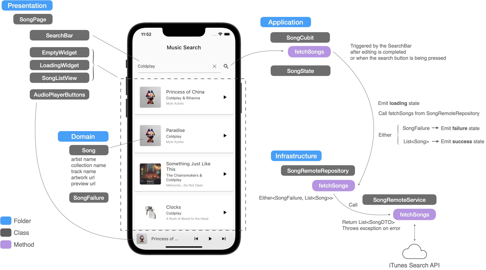
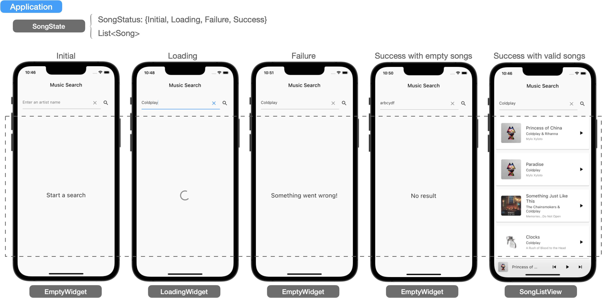
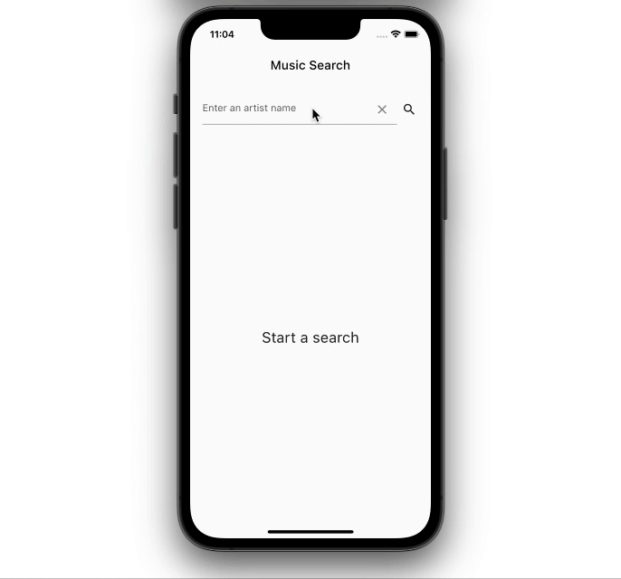

# itunes_search_api_example

A Music Search demo app using iTunes search api, which implements the Domain-Driven Design architecture inspired by ResoCoder to separate this application into layers (presentation, application, domain, infrastructure), and demonstrate how to write Unit tests and Widget tests to achieve more than 90% test coverages. Please check my [Medium post](https://medium.com/@yc.chuang/flutter-music-search-app-with-unit-and-widget-tests-f516bdf063b4) for more details.

## Preview

## Getting Started

This project is created on Flutter 2.10.3. [Freezed](https://pub.dev/packages/freezed) and [json_serializable](https://pub.dev/packages/json_serializable) are being used for generating unions/sealed classes, and help us doing toJson , fromJson functionality, Please run below command in the CLI before you run the project.

`flutter pub run build_runner build --delete-conflicting-outputs`
